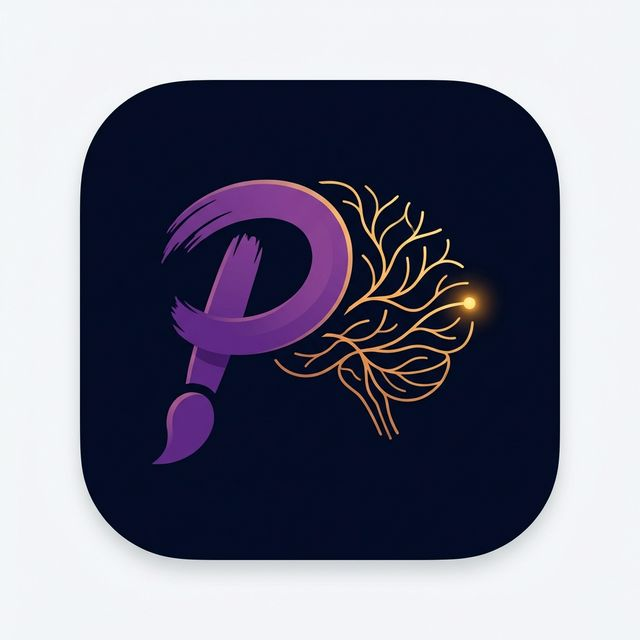

# PicturaAI — Neural Style Transfer Studio

<div align="center">
  
  <h1>PicturaAI</h1>
  <p><strong><em>Pictura</em> — Latin for "a painting."</strong><br/>
  Instant AI-powered Neural Style Transfer. Upload a photo, choose a masterpiece, get art.</p>

  <br/>

  
  
  
  

  <br/><br/>

  
</div>

---

## What Is PicturaAI?

PicturaAI transforms your everyday photos into stunning artwork by blending them with the brushstrokes, colours, and textures of famous paintings — powered by Google Magenta's pre-trained Neural Style Transfer model.

**Key highlights:**

- **Instant results** — single forward-pass model, no iterative optimisation
- **13 built-in art styles** — Van Gogh, Hokusai, Picasso, Munch, and more
- **Custom style upload** — use any painting or texture as a style source
- **Before/After comparison** — draggable split-view slider to compare original vs. stylized
- **Style Mixing** — blend two styles with an adjustable ratio (e.g. 70% Van Gogh + 30% Picasso)
- **Regional Styling** — paint a brush mask to control where the style applies
- **Generation History** — scrollable thumbnail strip of your last 10 results, click to reload any
- **Style Interpolation Animation** — generate a looping GIF that sweeps style intensity 0% → 100%
- **Color Palette Transfer** — transfer only the colour palette without changing texture (LAB histogram matching)
- **Real-time WebSocket progress** — watch your artwork being created live
- **Detail-preserving pipeline** — luminance-preserving blend, high-frequency reinjection, adaptive sharpening
- **One-click download** — save your masterpiece as a high-quality JPEG
- **Dynamic regeneration** — change style or intensity without re-uploading

---

## Tech Stack

| Layer | Technology |
|-------|-----------|
| **AI Model** | [Google Magenta Arbitrary Style Transfer v1-256](https://tfhub.dev/google/magenta/arbitrary-image-stylization-v1-256/2) via TF Hub |
| **Backend** | Python 3.10 · FastAPI · Uvicorn · TensorFlow 2.x · Pillow |
| **Frontend** | Vanilla HTML / CSS / JavaScript (zero frameworks) |
| **Real-time** | WebSocket streaming with automatic REST polling fallback |
| **Design** | Dark glassmorphism UI with CSS animations |

---

## Quick Start

### Prerequisites

- **Python 3.10+**
- **4 GB RAM** minimum (8 GB recommended)
- Stable internet for first run (model download ~100 MB, cached thereafter)

### 1. Clone the repository

```bash
git clone https://github.com/shashankpc7746/PicturaAI.git
cd PicturaAI
```

### 2. Create a virtual environment

```bash
python -m venv venv
```

### 3. Install dependencies

```bash
# Windows
.\venv\Scripts\pip install -r backend\requirements.txt

# macOS / Linux
venv/bin/pip install -r backend/requirements.txt
```

> TensorFlow (~600 MB) will download on the first install. Be patient!

### 4. Start the server

**Option A — One-click (Windows):**
```
start_server.bat
```

**Option B — Python launcher:**
```bash
python run.py
```

**Option C — Uvicorn directly:**
```bash
cd backend
../venv/Scripts/python -m uvicorn main:app --host 0.0.0.0 --port 8000
```

### 5. Open the studio

```
http://localhost:8000/app
```

On first run, the Magenta model (~100 MB) downloads from TF Hub and caches locally. Subsequent launches load instantly.

---

## Project Structure

```
PicturaAI/
├── backend/
│   ├── main.py              # FastAPI routes, WebSocket, job manager
│   ├── nst_engine.py         # NST pipeline (Magenta model + quality enhancements + style mixing + regional mask)
│   ├── requirements.txt      # Python dependencies
│   ├── uploads/              # Temp uploaded images (auto-created, git-ignored)
│   └── outputs/              # Generated results (auto-created, git-ignored)
│
├── frontend/
│   ├── index.html            # Main SPA — hero, studio, gallery, footer
│   └── assets/
│       ├── app.js            # Upload, WS client, progress, history, BA slider
│       ├── style.css         # Dark glassmorphism design system
│       ├── logo.png          # Brand logo
│       └── favicon.ico       # Browser favicon
│
├── images/
│   ├── content_image/        # Sample content photos
│   ├── style_image/          # 13 built-in art style images
│   └── generated images/     # Sample outputs
│
├── run.py                    # Python server launcher
├── start_server.bat          # Windows batch launcher
├── Dockerfile                # Container build
├── NST_Manual.ipynb          # Original Jupyter prototype
└── README.md
```

---

## How It Works

```
┌────────────┐     ┌────────────┐     ┌──────────────────────────────────────┐
│   Content   │     │   Style(s)  │     │          NST Pipeline                │
│   Image     │────▶│  1 or 2     │────▶│  1. Preprocess (resize, normalise)  │
│  (your pic) │     │ + opt mask  │     │  2. Stylize (Magenta forward pass)  │
└────────────┘     └────────────┘     │  3. Style mix (if 2 styles)        │
                                       │  4. Regional mask blend             │
                                       │  5. Luminance-preserving blend      │
                                       │  6. Detail reinjection + sharpening │
                                       └──────────────┬───────────────────────┘
                                                       │
                                                       ▼
                                              ┌────────────────┐
                                              │  Your Artwork   │
                                              │  (JPEG output)  │
                                              └────────────────┘
```

### Quality Enhancement Pipeline (v1.1)

1. **Higher resolution** — content images processed at up to 768px (raised from 512px)
2. **Luminance-preserving blend** — keeps content structure and edges sharp even at 100% style intensity
3. **High-frequency detail reinjection** — extracts fine textures from the original and adds them back to the styled result
4. **Adaptive unsharp mask** — final edge crispness that scales with style intensity

---

## Available Art Styles

| # | Style | Artist | Character |
|---|-------|--------|-----------|
| 1 | Starry Night | Van Gogh | Swirling cosmic energy |
| 2 | The Scream | Munch | Anguished expressionist curves |
| 3 | The Great Wave | Hokusai | Bold Japanese woodblock |
| 4 | La Muse | Picasso | Cubist fragments |
| 5 | Rain Princess | Afremov | Rainy street in warm colour |
| 6 | Udnie | Picabia | Abstract art-deco swirls |
| 7 | The Shipwreck | Turner | Dramatic seascape |
| 8 | Aquarelle | — | Soft watercolour washes |
| 9 | Chinese Ink | Traditional | Delicate ink brush strokes |
| 10 | Space | Digital | Nebulae and cosmic textures |
| 11 | Hampson | Hampson | Bold illustrative style |
| 12 | Mountain | Nature | Rugged mountain textures |
| 13 | Paris | Photography | Parisian street atmosphere |

> **Custom styles:** Switch to the "Upload Custom" tab and use any image as a style source.

---

## API Reference

| Method | Endpoint | Description |
|--------|----------|-------------|
| `GET` | `/` | Redirect to studio |
| `GET` | `/app` | Serve frontend SPA |
| `GET` | `/api/styles` | List all style presets with thumbnails |
| `POST` | `/api/transfer` | Start NST job → returns `job_id` (supports `mask_image`, `style_image_2`, `style_preset_2`, `style_mix_ratio`) |
| `GET` | `/api/jobs/{id}` | Poll job status, progress, preview |
| `GET` | `/api/result/{id}` | Download final JPEG |
| `DELETE` | `/api/jobs/{id}` | Cancel & cleanup job |
| `POST` | `/api/interpolate` | Generate style interpolation GIF (params: `num_frames`, `frame_duration`) |
| `POST` | `/api/palette-transfer` | Color palette transfer only (param: `strength`) |
| `WS` | `/ws/{job_id}` | Real-time progress stream |
| `GET` | `/docs` | Interactive Swagger UI |

### Example: Start a transfer

```bash
curl -X POST http://localhost:8000/api/transfer \
  -F "content_image=@photo.jpg" \
  -F "style_preset=starry_night" \
  -F "style_weight=0.75"
```

---

## Development

```bash
# Run with hot reload
cd backend
../venv/Scripts/python -m uvicorn main:app --reload

# Auto-generated API docs
http://localhost:8000/docs
```

---

## Deployment

### Docker

```bash
docker build -t picturaai .
docker run -p 8000:8000 picturaai
```

### Cloud (Render / Railway / Fly.io)

1. Push to GitHub
2. Connect the repo to your cloud platform
3. Set build command: `pip install -r backend/requirements.txt`
4. Set start command: `cd backend && python main.py`
5. Expose port `8000`

---

## Changelog

### v1.3 — Animation & Palette
- Style Interpolation Animation — generate a looping GIF sweeping style intensity 0% → 100%
- Color Palette Transfer Mode — toggle that transfers only colour using LAB histogram matching
- Two new API endpoints: `/api/interpolate` and `/api/palette-transfer`

### v1.2 — Creative Tools
- Before/After comparison slider — draggable split-view over the result
- Style Mixing — blend two styles with an adjustable ratio slider
- Regional Styling — brush mask to control where the style applies
- Generation History — scrollable strip of last 10 results with reload, delete, and clear
- Download from history items

### v1.1 — Quality & Polish
- Raised content resolution from 512px to 768px
- Luminance-preserving style blending
- High-frequency detail reinjection
- Adaptive unsharp mask post-processing
- 4-phase progress pipeline with real-time labels
- Suppressed all TensorFlow warnings
- Modern FastAPI lifespan handler
- Redesigned footer with tech pills
- SVG favicon

### v1.0 — Initial Release
- Full-stack Neural Style Transfer studio
- 13 built-in art styles + custom upload
- Real-time WebSocket progress with preview
- One-click download
- Dynamic regeneration
- Dark glassmorphism UI
- FastAPI backend with job queue

---

## License

MIT © 2026 [Shashank](https://github.com/shashankpc7746) · **PicturaAI** — Neural Style Transfer Studio
