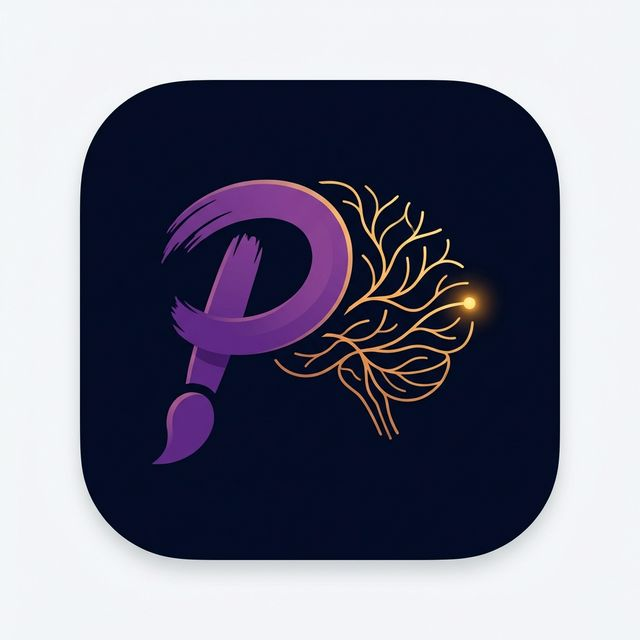

<div align="center">



# 🎨 PicturaAI

### Neural Style Transfer Studio — turn any photo into living art

*Pictura* — Latin for "a painting." Upload a photo, choose or describe a style, and generate stylized artwork in a single flow.

<br/>

[](https://picturaai-k7q6.onrender.com/app)
[](https://picturaai-k7q6.onrender.com/docs)

<br/>


</div>

---

## 📑 Table of Contents

- [Overview](#-overview)
- [Features](#-features)
- [Live Demo](#-live-demo)
- [Tech Stack](#-tech-stack)
- [Architecture](#-architecture)
- [Quick Start](#-quick-start-local)
- [Deployment](#-deployment-render)
- [API Reference](#-api-reference)
- [Built-In Styles](#-built-in-styles)
- [How It Works](#-how-it-works)
- [Project Structure](#-project-structure)
- [License](#-license)

---

## 🌟 Overview

PicturaAI is a full-stack Neural Style Transfer application built around **Google Magenta's arbitrary image stylization model**. It pairs a FastAPI backend with a vanilla HTML/CSS/JavaScript frontend and a quality-focused post-processing pipeline that produces stylized images in seconds while preserving the structure of the original photo.

It's a complete interactive studio — not just a model demo. Upload custom styles, blend two styles, paint regional masks, transfer only the color palette, generate interpolation GIFs, revisit past results, or describe a style in plain text.

---

## ✨ Features

| Category | What's Included |
|---|---|
| 🖼️ **Transfer modes** | Standard NST · palette-only transfer · text-to-style preset matching |
| 🎛️ **Creative controls** | Style mixing (blend two styles) · regional masking · style intensity slider |
| 📦 **Output tools** | Before/after compare slider · download · interpolation GIF · history strip |
| ⚡ **Runtime UX** | Synchronous generation · preset gallery · responsive dark UI |

<details>
<summary><b>📝 Feature details (click to expand)</b></summary>

- **Standard NST** — fast single-pass stylization via Magenta's pretrained model
- **Style Mixing** — blend two styles A/B with an adjustable ratio
- **Regional Masking** — paint exactly where the style should apply
- **Color Palette Transfer** — LAB-space color matching, no texture change
- **Text-to-Style** — type "watercolor portrait" and it picks the closest preset
- **Interpolation GIF** — animate the style sweeping from 0% → 100%
- **Before/After Slider** — drag to compare original vs styled
- **Generation History** — revisit and re-download the last 10 results

</details>

---

## 🚀 Live Demo

> **[👉 Try PicturaAI live](https://picturaai-k7q6.onrender.com/app)**

⚠️ Hosted on Render's **free tier**, so the first request after inactivity takes **~30–60s** to wake the server and load the model. After that, each transfer takes ~10–15s.

---

## 🛠 Tech Stack

| Layer | Technology |
|---|---|
| **Backend** | FastAPI · Uvicorn · Python 3.10 |
| **ML Model** | Google Magenta Arbitrary Image Stylization (TensorFlow Hub) |
| **Image Pipeline** | TensorFlow · NumPy · Pillow |
| **Frontend** | Vanilla HTML / CSS / JavaScript (no framework) |
| **Deployment** | Docker · Render |

---

## 🏗 Architecture

```text
┌─────────────────────────────────────────────────────────────┐
│                        Browser (SPA)                          │
│   index.html · app.js · style.css  →  served at /app          │
└───────────────────────────────┬───────────────────────────────┘
                                │  HTTP (multipart upload)
                                ▼
┌─────────────────────────────────────────────────────────────┐
│                    FastAPI Backend (main.py)                  │
│   • Routes / validation / style presets                       │
│   • Synchronous transfer (free-tier memory-safe)              │
└───────────────────────────────┬───────────────────────────────┘
                                │  run_in_executor
                                ▼
┌─────────────────────────────────────────────────────────────┐
│                  NST Engine (nst_engine.py)                   │
│   Preprocess → Magenta forward pass → luminance blend →       │
│   detail reinjection → sharpening → JPEG out                  │
└─────────────────────────────────────────────────────────────┘
```

---

## ⚡ Quick Start (Local)

### Prerequisites

- Python 3.10+
- 4 GB RAM
- Internet connection (first run downloads the TF Hub model, ~90 MB)

### Setup

```bash
git clone https://github.com/shashankpc7746/PicturaAI.git
cd PicturaAI
python -m venv venv

# Windows
venv\Scripts\pip install -r backend\requirements.txt

# macOS / Linux
venv/bin/pip install -r backend/requirements.txt
```

### Run

```bash
python run.py
```

Open **http://localhost:8000/app** 🎉

The first request downloads and caches the model. Subsequent starts are instant.

---

## ☁️ Deployment (Render)

Render is the recommended host — it supports Docker, persistent storage, and the memory TensorFlow needs.

### One-Click via Blueprint

1. Push this repo to GitHub.
2. Go to **[render.com](https://render.com)** → **New → Blueprint**.
3. Connect the repo — Render auto-detects [`render.yaml`](render.yaml).
4. Click **Apply**. Done.

### Manual Setup

| Setting | Value |
|---|---|
| Environment | Docker |
| Plan | Free (512 MB) |
| Health Check Path | `/api/styles` |
| Branch | `main` |

### 🧠 Free-Tier Memory Notes

TensorFlow is heavy. To fit inference within the **512 MB** free tier, the app:

- Runs the model at **320px** (`NST_MAX_DIM`)
- Limits TF to a single thread + `MALLOC_ARENA_MAX=2`
- Runs transfers **synchronously** (so a result is never lost to a restart)
- Forces garbage collection after each job

> 💡 **Want higher quality?** Upgrade to Render's Starter plan, then bump `NST_MAX_DIM` / `NST_OUTPUT_DIM` to `512` or `768` via env vars — no code changes needed.

<details>
<summary><b>⚙️ Tunable environment variables</b></summary>

| Variable | Default | Purpose |
|---|---|---|
| `NST_MAX_DIM` | `320` | Model inference resolution (memory-critical) |
| `NST_OUTPUT_DIM` | `320` | Final output resolution |
| `MALLOC_ARENA_MAX` | `2` | Limits glibc memory arenas |
| `TF_NUM_INTRAOP_THREADS` | `1` | TF compute threads |
| `TF_NUM_INTEROP_THREADS` | `1` | TF op-scheduling threads |
| `TFHUB_CACHE_DIR` | `/app/.tfhub_cache` | Pre-cached model location |

</details>

### Why Render over Vercel?

| Concern | Render | Vercel |
|---|:---:|:---:|
| Long-running inference | ✅ | ❌ (10s timeout) |
| TensorFlow + large model | ✅ | ❌ (250 MB limit) |
| Docker deployment | ✅ | ❌ |
| Persistent filesystem | ✅ | ❌ |

Vercel is excellent for static sites and edge functions, but PicturaAI needs a real long-lived server with enough memory for TensorFlow.

---

## 📡 API Reference

| Method | Endpoint | Purpose |
|---|---|---|
| `GET` | `/` | Redirects to the studio |
| `GET` | `/app` | Frontend studio |
| `GET` | `/api/styles` | Built-in styles with thumbnails |
| `POST` | `/api/transfer` | Run a style transfer (returns result) |
| `GET` | `/api/result/{job_id}` | Download result JPEG |
| `POST` | `/api/interpolate` | Generate interpolation GIF |
| `POST` | `/api/palette-transfer` | Color-palette-only transfer |
| `GET` | `/docs` | Swagger UI |

<details>
<summary><b>📤 Transfer request fields</b></summary>

- `content_image` — your photo (**required**)
- `style_image` **or** `style_preset` **or** `text_prompt` — the style source
- `style_weight` — intensity, `0.0`–`1.0`
- `style_image_2` / `style_preset_2` — optional second style for mixing
- `style_mix_ratio` — blend ratio between two styles
- `mask_image` — optional regional mask (white = apply style)

</details>

```bash
# Example: preset-based transfer
curl -X POST https://picturaai-k7q6.onrender.com/api/transfer \
  -F "content_image=@photo.jpg" \
  -F "style_preset=starry_night" \
  -F "style_weight=0.75"
```

---

## 🖌 Built-In Styles

| Style | Artist | Character |
|---|---|---|
| Starry Night | Van Gogh | Swirling cosmic energy |
| The Scream | Munch | Expressive dramatic curves |
| The Great Wave | Hokusai | Japanese woodblock print |
| La Muse | Picasso | Cubist geometry |
| Rain Princess | Afremov | Warm rainy reflections |
| Udnie | Picabia | Abstract dynamic motion |
| The Shipwreck | Turner | Stormy seascape |
| Aquarelle | — | Soft watercolor wash |
| Chinese Ink | Traditional | Brush and ink minimalism |
| Space | Digital | Cosmic nebula textures |
| Hampson | Illustration | Bold graphic style |
| Mountain | Nature | Rugged landscape |
| Paris | Photography | Urban atmosphere |

---

## 🔬 How It Works

1. **Upload** a content photo and pick / describe a style.
2. **Preprocess** — content resized for efficient inference, style resized to 256×256.
3. **Stylize** — one forward pass through Magenta's model (no slow iterative optimization).
4. **Enhance** — luminance-preserving blend keeps your subject sharp; high-frequency details are reinjected from the original.
5. **Finalize** — adaptive sharpening, JPEG export, result returned to the browser.

---

## 📂 Project Structure

```text
PicturaAI/
├── backend/
│   ├── main.py              # FastAPI app, routes, transfer pipeline
│   ├── nst_engine.py        # TF Hub model + image pipeline
│   └── requirements.txt     # Python dependencies
├── frontend/
│   ├── index.html           # Single-page studio UI
│   └── assets/              # app.js, style.css, logo, favicons
├── images/
│   └── style_image/         # 13 built-in style presets
├── Dockerfile               # Production container
├── render.yaml              # Render deploy blueprint
└── run.py                   # Local dev launcher
```

---

## 🧑‍💻 Development

```bash
# Run with auto-reload
cd backend
../venv/Scripts/python -m uvicorn main:app --reload

# API docs at http://localhost:8000/docs
```

---

## 📄 License

[MIT](LICENSE) © 2026 Shashank

<div align="center">
<br/>
Made with 🎨 and TensorFlow · <a href="https://picturaai-k7q6.onrender.com/app">Try it live</a>
</div>
